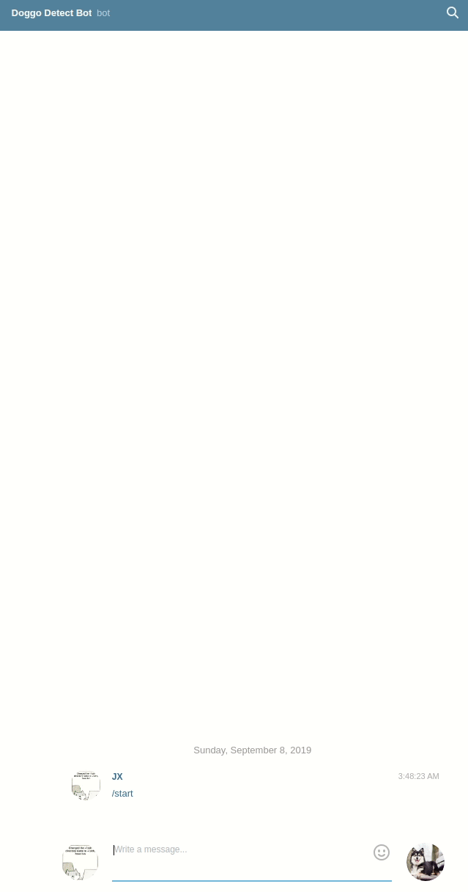

# End-to-End Dog Breed Image Classification Chatbot

Side project to learn more about image classification and end-to-end machine learning 
- From data collection/scraping to deployment

Bot was previously deployed on an EC2 instance (Ubuntu) as a service
- When I still had AWS Educate credits

## Table of Contents:
- [Data Scraping](#data-scraping)
- [Data Collection](#data-collection)
- [Custom Image Processing](#custom-image-processing)
- [Initial Modeling](#initial-modeling)
- [Transfer Learning](#transfer-learning)
- [Bot Development](#bot-development)
- [Deployment](#deployment)
- [Usage](#usage)
- [Built With](#built-with)
- [Author](#author)
- [License](#license)

## Data Scraping
The class labels (dog breeds) are obtained from a website listing 209 dog breeds and are extracted using 
a simple function utilising BeautifulSoup4 library. 

The function is named [scrape_for_scraps](image_scrapper/scraper_downloader.py#14) and its Python corresponding
script can be found [here.](image_scrapper/scraper_downloader.py#94)

## Data Collection
The image dataset (dog breed images) is gathered with the use of Google Image Search API. 
Image links are retrieved from Google Image Search API (limit of 100 images per search)
and the images are downloaded using Python's Requests library.

The Google Image Search API function can be found [here.](image_scrapper/scraper_downloader.py#64)

The image downloader function can be found [here.](image_scrapper/scraper_downloader.py#52)

## Custom Image Processing
A image processor was developed to handle basic image manipulation:
- [Loading images](image_preprocess.py#67)
- [Image pixel normalisation](image_preprocess.py#94)
- [Image resizing](image_preprocess.py#122)
- [Image padding](image_preprocess.py#149)

## Initial Modeling
A simple [convolution neural network architecture](image_classifier_model.py#32) is developed and a model was trained with the image dataset.
- However, too computationally heavy to train the model till a respectable performance is achieved
- Attained ~5% classification accuracy on test set after training with a laptop's CPU (X1 Carbon 4th Gen)

## Transfer Learning
A pre-trained image classification model trained on the ImageNet dataset was used and the chosen architecture was 
Xception as it has the same number of parameters as Inception V3 but has better classification performance. 
Only the last layer of weights are retrained to refit the model to be capable of performing dog breed classification.

The code for transfer learning can be found [here.](image_classifier_model.py#72)

## Bot Development
The Telegram bot functionality is created by utilising Python's requests library to interact with Telegram's Bot API.

Some of the bot's functionality includes:
- Image message recognition (uploaded via Gallery or via @pic)
- Responding to directed messages
- Downloading the image in the message
- Managing the dog breed classification model and using it for image prediction

The Telegram bot implementation can be found [here.](telegram_bot/doggo_detect_bot.py)

## Deployment
Dog breed image classification bot was deployed on a AWS EC2 t3.small instance:
- Initially set to run indefinitely with a cron job restarting the bot every hour
- Switched to running the bot as a service with systemd, enabling the bot to be restarted automatically only if it terminates

## Usage
The gif below shows a sample usage of the bot when it was active.

## Built With
* [Google Search API](https://github.com/googleapis/google-api-python-client) - Data collection
* [BeautifulSoup4](https://www.crummy.com/software/BeautifulSoup/bs4/doc/) - Web scraping for class labels
* [Requests](https://2.python-requests.org/en/master/) - Image downloads and bot requests
* [OpenCV](https://github.com/opencv/opencv) - Image processing and manipulation
* [Keras](https://github.com/keras-team/keras) - Modeling, transfer learning, etc.

## Author

* **Lim Jia Xiang** - *Initial work* - [limjiaxiang](https://github.com/limjiaxiang)

## License

This project is licensed under the Apache License Version 2.0 - see the [LICENSE.txt](LICENSE.txt) file for details
